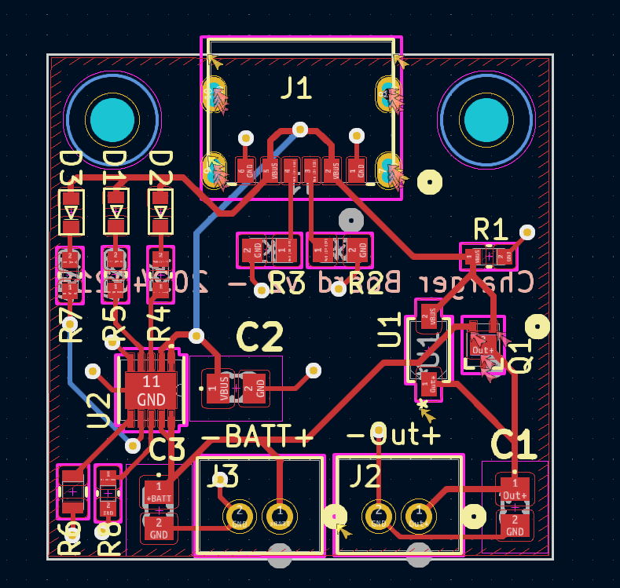
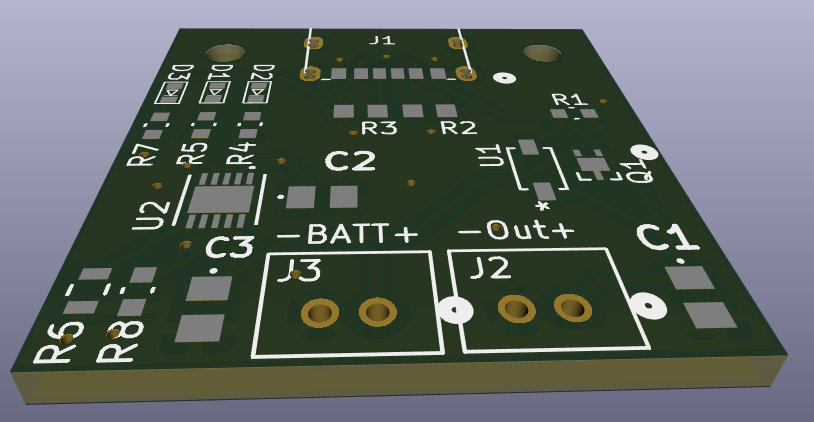
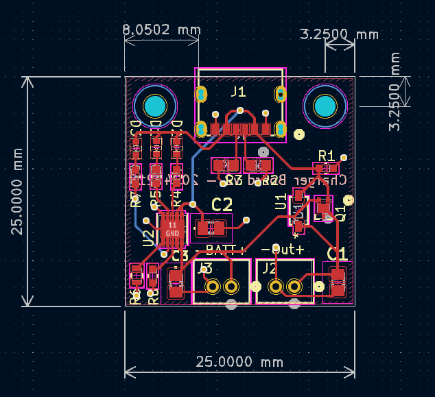

# USB C POWER SUPPLY 2 (Single Cell LiPo 18650)

I made this as I couldn't find any board that did exactly what I needed. I used some of these (https://www.ebay.co.uk/itm/196094318206) before, but they have two main issues:

1) Doesn't charge with most USB chargers, as they ignore PD and only charge with USB-A to USB-C cables
2) Don't switch between battery and usb power

## Warning

This board does protect against overcharging, but not against discharge, so make sure you use protected cells.

## Schematic

[Schematic](img/schematic.png)

## PCB

## Parts

<table>
    <tr><td>J1</td><td><a href="https://uk.farnell.com/global-connector-technology/usb4125-gf-a-0190/usb-conn-type-c-r-a-rcpt-6pos/dp/3777661">GCT USB4125-GF-A-0190</a></td></tr>
    <tr><td>R2,R3</td><td><a href="https://uk.farnell.com/panasonic/erj6geyj512v/res-5k1-5-0-125w-0805-thick-film/dp/2057715">PANASONIC ERJ6GEYJ512V</a></td></tr>
    <tr><td>R4,R5,R7</td><td><a href="https://uk.farnell.com/panasonic/erj3geyj471v/res-470r-5-0-1w-0603-thick-film/dp/2059592">PANASONIC ERJ3GEYJ471V</a></td></tr>
    <tr><td>D1,D2,D3</td><td><a href="https://uk.farnell.com/multicomp-pro/mp008284/led-blue-200mcd-475nm-0603/dp/3796315">MULTICOMP PRO MP008284 (D1->Green, D2-> Blue, D3-> Red)</a></td></tr>
    <tr><td>R6</td><td><a href="https://uk.farnell.com/panasonic/erjup3j102v/res-1k-5-0-25w-0603/dp/3579508">PANASONIC ERJUP3J102V</a></td></tr>
    <tr><td>U2</td><td><a href="https://uk.farnell.com/microchip/mcp73833-ami-mf/batt-charger-li-ion-pol-1a-dfn/dp/2709765">MICROCHIP MCP73833-AMI/MF</a></td></tr>
    <tr><td>C1,C2,C3</td><td><a href="https://uk.farnell.com/kemet/c0805c106k8pactu/cap-10-f-10v-10-x5r-0805/dp/1463362">KEMET C0805C106K8PACTU</a></td></tr>
    <tr><td>U1</td><td><a href="https://uk.farnell.com/on-semiconductor/mbr0540t3g/diode-schottky-0-5a-40v-sod-123/dp/2101839">ONSEMI MBR0540T3G</a></td></tr>
    <tr><td>Q1</td><td><a href="https://uk.farnell.com/diodes-inc/dmg3415ufy4q-7/mosfet-p-ch-16v-2-5a-x2-dfn2015/dp/3943489">DIODES INC. DMG3415UFY4Q-7</a></td></tr>
    <tr><td>R1,R8</td><td><a href="https://uk.farnell.com/panasonic/erj3geyj103v/res-10k-5-0-1w-0603-thick-film/dp/2059627">PANASONIC ERJ3GEYJ103V</a></td></tr>
    <tr><td>J2,J3</td><td>JST PH 2mm connectors</td></tr>
    

</table>

